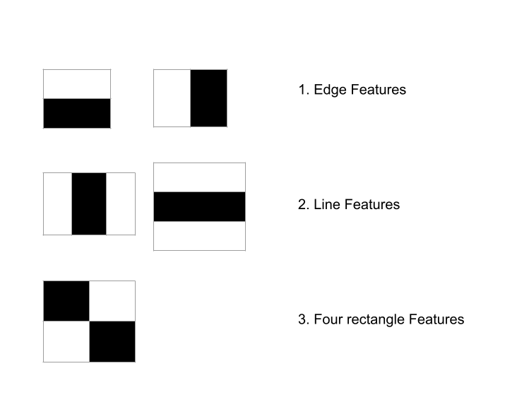
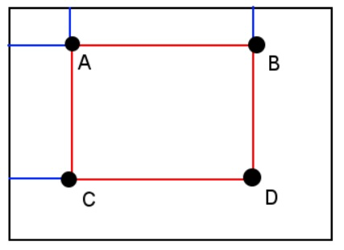

# Machine Learning methods for Computer Vision

As we have already seen, before the deep learning era most computer vision methods used handcrafted features. The difficulty in selecting the most suitable features for a vision task has hindered the reliability of such methods for image detection, classification, and segmentation.

Nonetheless, some traditional machine learning methods have been successfully applied to computer vision. In this unit, we will see some of them, including dimensionality reduction (particularly, Bag of Words applied to local descriptors), and face detection and recognition (Viola-Jones and EigenFaces) that have been successfully applied in the literature.

## Bag of Features

The Bag of Features (BoF) method, also known as Bag of Words (BoW), can be used to reduce the dimensionality of local descriptors.  BoW is a method to represent image features, and it is inspired by the bag-of-words model often used in the context of Natural Language Processing, hence the name. 

This section explains the BOW method formally.

Let's consider a training dataset \(𝐷=\{𝑥_1,…,𝑥_𝑁\}\) of \(𝑁\) training images. Note that an image \(𝑥_𝑖\in 𝐷\) may contain a different number of features (keypoints and descriptors) than another image. One of the main problems of SIFT or SURF is that performing a similarity search between two images implies to match all points from image \(x_i\) with the points of image \(x_j\), which is a very costly procedure with a complexity \(O(NM)\), being \(N\) and \(M\) the number of keypoints of \(x_i\) and \(x_j\), respectively. 

BoW extracts a single feature vector of fixed-size \(𝑘\) for any image independently of its number of keypoints. 

<!-- Explicación: https://ai.stackexchange.com/questions/21914/what-are-bag-of-features-in-computer-vision -->

The BoW process can be divided into three steps:

1. **Feature extraction** 
   First, we extract the features (i.e. keypoints and descriptors) from all images in the training dataset \(𝐷\). This can be done, for example, using SIFT. Let \(𝐹=\{𝑓_1,…,𝑓_𝑀\}\) be the set of descriptors extracted from all training images in \(𝐷\). So, \(𝑓_𝑖\) may be a descriptor that belongs to any of the training examples (it is not stored to which one).

2. **Codebook generation**.
   In this step, we cluster all descriptors \(𝐹=\{𝑓_1,…,𝑓_𝑀\}\) into \(𝑘\) clusters using \(k\)-means (or another clustering algorithm. Therefore, we have \(𝑘\) clusters, each of them with a centroid \(𝐶=\{𝑐_1,…,𝑐_𝑘\}\). These centroids represent the main features that are present in the whole training dataset \(𝐷\). In this context, they are often known as codewords or visual words (hence the name bag-of-visual-words). The set of codewords \(𝐶\) is often called codebook or vocabulary.

3. **Feature vector generation**.
   In this last step, given a new image \(𝑢∉𝐷\), we  represent \(𝑢\) as a \(𝑘\)-dimensional vector (where \(𝑘\) is the number of codewords). To do that, we need to follow the following steps: 
   1) Extract the raw features from \(𝑢\) with e.g. SIFT (as we did for the training images). Let the descriptors of \(𝑢\) be \(𝑈=\{𝑢_1,…,𝑢_{|𝑈|}\}\). 
   2) Create a vector \(𝐼\) of size \(𝑘\) filled with zeros, where the \(𝑖\)th element of \(𝐼\) corresponds to the \(𝑖\)th codeword (or cluster).
   3) For each descriptor \(𝑢_𝑖\), find the closest codeword (or centroid) in \(𝐶\). Once found, increment the value at the \(𝑗\)th position of \(𝐼\) (i.e., initially, from zero to one), where \(𝑗\) is the closest codeword to the descriptor \(𝑢_𝑖\) of the query image. The distance between \(𝑢_𝑖\) and any of the codewords can be computed with the Euclidean distance, for example. 

At the end of this process, we obtain a feature vector \(𝐼\) of size \(k\) that represents a **histogram of codewords** for the query image. Here is an illustrative example of such a histogram:


 As can be seen, an image can be represented by a histogram of codewords. In this example, for the sake of clarity there are only 4 codewords.

Alternatively, rather than the codeword frequency, we can use the tf-idf. In that case, instead representing each image with a vector that contains the frequency of the codewords, it is represented with the frequency of the codewords weighted by their presence in other images. 

<!---
### Implementation in OpenCV

With the following code, we can train a BoW codebook from the SIFT descriptors extracted from all the images in a training set:

```python
# We create a BOW instance, in this case the vocabulary will have 100 codewords
BOW = cv.BOWKMeansTrainer(100)
sift = cv.SIFT_create()

# We go through all the images extracting SIFT descriptors and adding them so we can train our BOW.
for file in imagesPath:
     image = cv.imread(file, cv.IMREAD_GRAYSCALE)
     keypoints, descriptors = sift.detectAndCompute(image, None)
     BOW.add(descriptors)

# We train the BoW to obtain the codebook (vocabulary)
vocabulary = BOW.cluster()
```

Note that you must include the path to one or more images in the `imagesPath` variable in order to run the code. 

Once the code is executed, we obtain a trained dictionary of `k=100` words. Next we can extract a descriptor and convert it into a histogram of codewords (this will be our new descriptor for that image).

```python
# We initialize the extractor, which will be based on SIFT and which will assign clusters by brute force
BOWExtractor = cv.BOWImgDescriptorExtractor(sift, cv.BFMatcher(cv.NORM_L2))

# We assign to the declared extractor the vocabulary we had trained
BOWExtractor.setVocabulary(vocabulary)

# Now we can extract the BoW feature of an image
BOWdescriptor = BOWExtractor.compute(image, sift.detect(image))

# We show the descriptor
plt.hist(BOWdescriptor[0], 100)
plt.show()
```

You can see complete code examples for training and recognition with BOW [here](https://github.com/briansrls/SIFTBOW/blob/master/SIFTBOW.py) and also [here](https://github.com/mgmacias95/Flower-Recognition/blob/master/flower.py).
--->

## Face detection

Identifying human faces in digital images is one of the few computer vision tasks that has been succesfully approached using machine learning. 


Face detection can be regarded as a specific case of object detection. The goal of object detection methods is to find the bounding boxes (locations and sizes) of specific objects in an image. 

<!--
https://www.baeldung.com/cs/viola-jones-algorithm#:~:text=Viola%2DJones%20algorithm%20is%20a,primarily%20conceived%20for%20face%20detection.

https://en.wikipedia.org/wiki/Viola–Jones_object_detection_framework

https://www.cs.ubc.ca/~lowe/425/slides/13-ViolaJones.pdf

-->

### Viola-Jones

The Viola-Jones algorithm, developed by Paul Viola and Michael Jones in 2001, is a pioneering technique in computer vision for its use in real-time face detection. It's recognized for its speed and accuracy, making it particularly suitable for applications like surveillance and web cameras. It was groundbreaking for its time, providing a robust and efficient method for real-time face detection, and its principles are still used and built upon in more modern face detection technologies.

The full paper is [in this link](https://www.cs.cmu.edu/~efros/courses/LBMV07/Papers/viola-cvpr-01.pdf), but here we are going to see a summary of its key components, that will be described in detail below:

1. **Haar Features:**
   The algorithm uses Haar-like features, which are simple rectangular patterns. These features are used to capture the presence of oriented contrasts between different regions of an image. For example, a feature might focus on the intensity difference between the eye region and the cheek region in a face. 
   
2. **Integral image**
   The Haar features are efficiently calculated using the integral image. This is a representation of an image that allows for the rapid calculation of the sum of pixel values in any rectangular area. In this representation, each point \((x, y)\) in the integral image contains the sum of the pixel values above and to the left of \((x, y)\), inclusive.

3. **Adaptive Boosting (AdaBoost):**
   AdaBoost is a supervised machine learning method based on boosting. In the context of the Viola-Jones algorithm, it is used to select a small number of important features from a larger set, and also to train classifiers that use these features. 

4. **Attentional Cascade:**
   The algorithm uses a cascade of classifiers to quickly discard non-facial regions in an image, thereby reducing the computational burden. Each stage of the cascade is a classifier made up of a combination of several features. Early stages use fewer features for a rough filter, effectively discarding large areas of the image where a face is unlikely to be found. Subsequent stages use more features for a finer analysis.

<!--
5. **Scaling for Multi-size Face Detection:**
   To detect faces of various sizes, the Viola-Jones algorithm scales the detection window rather than the image, efficiently searching for faces across different scales.
-->

Now, let's dive into these components:

**1. Haar features**

The Viola-Jones algorithm uses a set of features similar to Haar wavelets, which are a set of square-shaped functions. More specifically, the algorithm uses three types of Haar-like features represented in the following figure:



In these boxes, white represents 1, and black is -1. Therefore, when convolving a feature with a part of the image, the sum of the pixels which lie within the white rectangles are subtracted from the sum of pixels in the black rectangles.

Tthe feature value will be around zero for “flat regions”, i.e., where all the pixels have the same value. A large feature value will be obtained in the regions where the pixels in the black and white rectangles are very different.

As shown below, the following features have great importance in face detection since the eye region is darker than the cheeks, and also darker than the nose region. 


**2. Integral image**

The Haar features could be computed on an image using convolutions, but since they are  "flat" (black or white), they can also be efficiently calculated using the integral image. Hence, the Haar-like features can be computed very quickly using the integral image representation.

The integral image is calculated as follows. Given a grayscale image \(I\), the integral image value \(ii(x, y)\) at the point \((x, y)\) is the sum of all the pixels above and to the left of \((x, y)\), inclusive:

$$ii(x, y)=\sum_{\substack{x^{\prime} \leq x \\ y^{\prime} \leq y}} I\left(x^{\prime}, y^{\prime}\right)$$

The integral image can be computed in a single pass over the image \(I\) with the following equation:

$$ii(x, y)=I(x, y)+ii(x, y-1)+ii(x-1, y)-ii(x-1, y-1)$$

Therefore, given an image with \(N\) pixels, the time complexity of the integral image computation is \(O(N)\).

The sum in any rectangular area requires four values of the integral image, regardless of the window size:



More specifically, the sum of pixel values within any rectangle \(ABCD\) of a Haar-like feature can be computed as:

$$\sum_{\substack{x_0<x \leq x_1 \\ y_0<y \leq y_1}} I(x, y)=ii(D)+ii(A)-ii(B)-ii(C)$$

Therefore, the calculation of the feature value for a black or white region is straighforward and very efficient, requiring only three sums. 

<!--


COJONUDO EJERCICIO: https://github.com/varunjain3/EigenFaces#1.-Viola-Jones-Face-Detection
--->

**3. Adaptive Boosting (AdaBoost):**

<!--
Buen video Adaboost (idea): https://www.youtube.com/watch?v=hfSKfuUVu9I
Mejor explicación: https://www.analyticsvidhya.com/blog/2021/03/introduction-to-adaboost-algorithm-with-python-implementation/

https://www.youtube.com/watch?v=O7J9Dl1cWmM


-->

Adaptive boosting is a boosting ensemble technique that sequentally trains weak classifiers to create a strong classifier. 

You can see [this explanation with an associated video](https://www.analyticsvidhya.com/blog/2021/03/) to get an overview of the AdaBoost algorithm. Basically, at each iteration, a weak classifier is trained using as input the dataset giving higher weights to data points that were wrongly predicted by previous classifiers. 


The AdaBoost algorithm has the following steps:
1. Train a model and perform inference
2. Assign higher weights to misclassified points
3. Train next model
4. Repeat steps 2 and 3
5. Get a weighted average of individual models

At the end, a strong classifier is built with the weighted combination of individual models.

In the context of Viola-Jones method, AdaBoost is used to select a small number of relevant visual features. Within any image sub-window, the total number of Harr-like features is very large (far larger than the number of pixels). In order to ensure fast classification, the learning process must exclude a large majority of the available features, and focus on a small set of critical features. 

Feature selection is achieved through a simple modification of AdaBoost: The weak learner is constrained so that each weak classifier returned depends only of a single feature. As a result, each stage of the boosting process  (which selects a new weak classifier) can be seen as a feature selection process. 

Viola-Jones selected the best 6000 features using feature selection, although with the best 200 features the method already achieved an accuracy of 95%.

The best two features chosen are shown in the previous figure (see 1. Haar features). They are focused on the detection of the eyes and the nose.

**4. Classifier Cascades**

The Viola-Jones method uses sliding windows on the image (originally of size 24x24) and, for each window, 6000 features are selected to detect if there is a face on a given region. 

Nonetheless, with 6000 features the complexity is still too high for real-time processing, so the authors found another solution. In an image, most pixels do not correspond to faces, so they devised a method to quickly detect if a window had face pixels, and if not, discard it.

For this, Viola-Jones used a cascade of classifiers, also trained with AdaBoost. Instead of applying the 6000 features per window, the features were placed in different stages in a hierarchical manner (each with its own classifier). If in the first stage, the window returns that there is no face, it is discarded and the following ones are not considered. If it passes, the second phase is applied, and so on until the end is reached (if it passes all of them, then it is a face).


The 6000 features were separated into 38 stages with 1, 10, 25, 25 and 50 features in the first five stages, placing the best features first.

## Face recognition

A facial recognition system aims to match a given human face against a dataset of faces. Such a system is typically employed to authenticate users through identity verification services, and typically works by pinpointing and measuring facial features from a given image.

Eigenfaces is a remarkable face recognition technique that has been widely used on devices before the deep learning era. We are going to describe it next. 

### Eigenfaces

[Eigenfaces](https://sites.cs.ucsb.edu/~mturk/Papers/mturk-CVPR91.pdf) is a method used in computer vision and face recognition that involves a mathematical approach to process human faces. The concept can be broken down into several key points:

1. **Principal Component Analysis (PCA)**. The core of eigenfaces is Principal Component Analysis, a statistical method used to reduce the dimensionality of large datasets while preserving most of the variance in the data. PCA identifies the directions (principal components) in which the data varies the most.

2. **Application to faces**. In the context of face recognition, each face image is converted into a vector of pixel values. These vectors form a high-dimensional dataset. PCA is applied to this dataset to identify the principal components. These components are essentially the 'eigenfaces', which are a set of standardised face images. Eigenfaces serve as a basis set for representing faces. Any face can be approximated by a combination of these eigenfaces, so each face in the dataset can be represented as a weighted sum of eigenfaces. The weights indicate how much each eigenface contributes to the particular face image.

3. **Face Recognition**. During training, a dataset of faces is used to compute the eigenfaces and the weights for each known face. For recognition, the same process is applied to a new face image to obtain its weights. The new face is then compared to the known faces by measuring the similarity in their weights.

Here you can see some examples of eigenfaces:

 

Any human face can be considered to be a combination of these standard eigenfaces. For example, one's face might be composed of the average face plus 10% from eigenface 1, 55% from eigenface 2, and even −3% from eigenface 3. Remarkably, it does not take many eigenfaces combined together to achieve a fair approximation of most faces. 

Also, because a person's face is not recorded by a digital photograph, but instead as just a list of values (one value for each eigenface in the database used), much less space is taken for each person's face. Therefore, one of the main advantages of this method is efficiency: Reducing faces to weights on eigenfaces significantly reduces the amount of data to be processed. Another strength is that eigenfaces can generalize well to new faces not seen during training.

However, eigenfaces have also some limitations. The method may struggle with variations in lighting, facial expressions, and pose. Also, it relies on a good alignment of faces in the  images.

Eigenfaces was one of the first successful applications of PCA to face recognition and has laid the groundwork for more sophisticated methods in computer vision and pattern recognition.

<!--

Recognition: EigenFaces (+ Fisherfaces?)

https://en.wikipedia.org/wiki/Eigenface

http://www.scholarpedia.org/article/Eigenfaces

Para ejercicio: https://github.com/varunjain3/EigenFaces/blob/master/EigenFace_Method.ipynb

-->

Various extensions have been made to this approach. The eigenfeatures method combines facial metrics (measuring distance between facial features) with the eigenface representation. Fisherface uses linear discriminant analysis (LDA) and is less sensitive to variation in lighting and pose of the face. Fisherface uses labelled data to retain more of the class-specific information during the dimension reduction stage.
